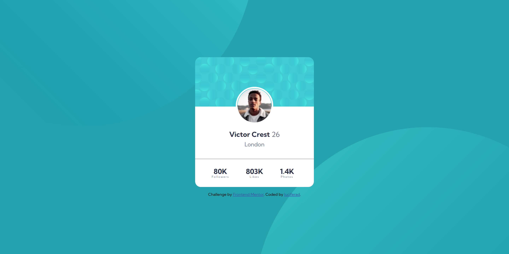

# Frontend Mentor - Profile card component solution

This is a solution to the [Profile card component challenge on Frontend Mentor](https://www.frontendmentor.io/challenges/profile-card-component-cfArpWshJ). Frontend Mentor challenges help you improve your coding skills by building realistic projects. 

## Table of contents

- [Overview](#overview)
  - [The challenge](#the-challenge)
  - [Screenshot](#screenshot)
  - [Links](#links)
- [My process](#my-process)
  - [Built with](#built-with)
  - [What I learned](#what-i-learned)
  - [Continued development](#continued-development)
  - [Useful resources](#useful-resources)
- [Author](#author)

## Overview

### The challenge

- Build out the project to the designs provided

### Screenshot



### Links

- Solution URL: [Github](https://github.com/luciferad/profile-card-component-main)
- Live Site URL: [Github](https://luciferad.github.io/profile-card-component-main/)

## My process

### Built with

- Semantic HTML5 markup
- CSS custom properties
- Flexbox
- CSS Grid

### What I learned

In previous projects I used a 'div' for the circle of profile picture. But in this project I learned to use picture border instead of using 'div'.
```css
img {
  border: solid var(--dark-gray) 1px;
  border-bottom: none;
}
```
Also I used precentage measurement fo positioning the background. But in this project I learned to use 'vw' & 'vh' instead.
```css
body {
  background-position: right 50vw bottom 50vh;
}
```

### Continued development

After working on six projects, I still belive that I have to continue working on layouts, especially with Flex & Grid.

### Useful resources

- [Learning Web Design](https://www.amazon.com/Learning-Web-Design-Beginners-JavaScript/dp/1491960205) - A great book for begining.
- [W3Schools](https://www.w3schools.com) - A handy reference for learning frontend.

## Author

- Github - [@luciferad](https://github.com/luciferad)
- Frontend Mentor - [@luciferad](https://www.frontendmentor.io/profile/luciferad)